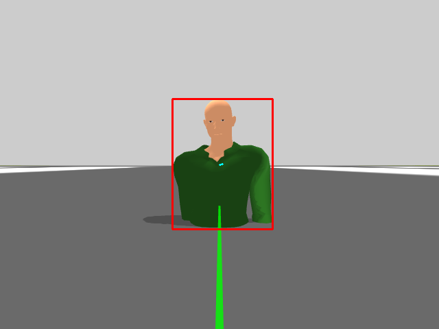
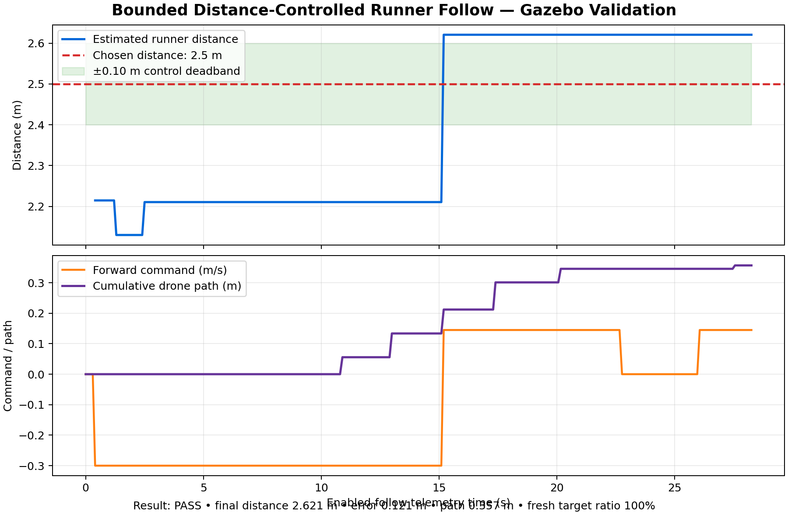

# Project history

This file summarizes the major working milestones. Git commits and pull
requests remain the authoritative record and preserve every earlier version.

## 1. Original YOLO tracking prototype

Commit `58d5565` preserved the original single-file implementation. It proved
that OpenCV video input, YOLO person detection, bounding boxes, and image-offset
calculations could work together before the code was reorganized.

## 2. Modular laptop-camera perception

Commit `35b0d53` separated camera input, person detection, runner selection,
tracking, annotation, and pipeline coordination into testable classes. This
milestone made it possible to diagnose components independently instead of
maintaining one large script.

## 3. Gazebo camera and ROS 2 bridge

Commit `a23ebf4` documented the working Gazebo camera-to-ROS workflow. It
established the simulated Iris camera topic, ROS image bridge, perception node,
and image-viewer process.

## 4. Autonomous distance-controlled runner following

This milestone adds three ROS 2 packages:

- `drone_perception`: asynchronous YOLO reacquisition and fast box tracking
- `drone_control`: runner centering, distance regulation, MAVROS commands, and
  safety gating
- `drone_simulation`: moving actor, custom Iris camera, and LiDAR world

The controller estimates runner distance from the calibrated bounding-box area
because the horizontal LiDAR beam sits above a ground-level person's body. The
LiDAR remains an independent emergency obstacle stop. A proportional distance
controller applies forward or reverse velocity to hold a configurable target,
turns before translating when the runner is off-center, and stops on stale
perception data.

### Passing validation

The protected simulation completed takeoff, moving-person detection, bounded
following, and landing. It recorded:

| Measurement | Result |
|---|---:|
| Desired trailing distance | 2.500 m |
| Final estimated distance | 2.621 m |
| Final distance error | 0.121 m |
| Horizontal drone path | 0.357 m |
| Fresh runner targets | 100% |
| Minimum validation altitude | 2.190 m |
| Automated result | `FOLLOW_VALIDATION_PASS` |

▶️ [Watch the 15-second annotated follow video](docs/media/distance_follow_gazebo_15s.mp4)

Raw evidence is stored in
[`docs/evidence/distance_follow_validation.csv`](docs/evidence/distance_follow_validation.csv).

### Recorded follow demonstration

A separate protected recording run also passed. The drone-camera MP4 shows the
YOLO bounding box following the moving actor for 15.000 seconds. That run held
100% fresh targets, moved 0.154 m, and finished at an estimated 2.295 m from
the runner—0.205 m from the selected 2.5 m trailing distance—before landing.

### Safety boundaries

- Flight movement requires an explicit activation message.
- Missing or stale person detections produce zero velocity.
- Forward motion is blocked by stale LiDAR data or a close obstacle.
- Forward, reverse, and yaw rates are capped in configuration.
- The validation harness requires a detected runner before enabling motion.
- Main-flow and independent-watchdog LAND commands protect every test.

## Next milestone

Build a local point cloud and rolling cost map, then add reactive obstacle
avoidance while keeping person following and flight-control safety isolated.
