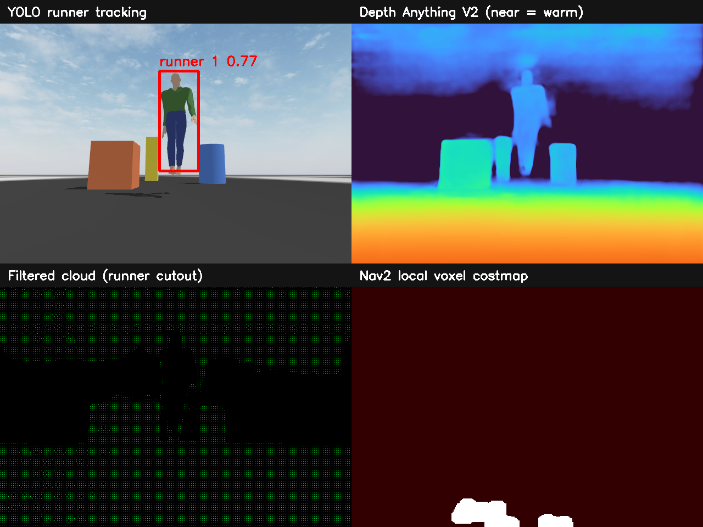
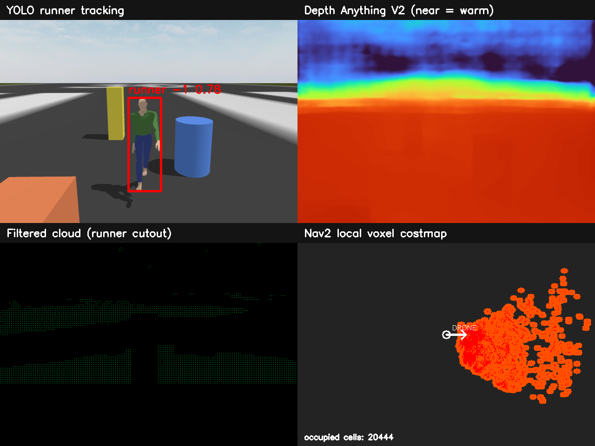
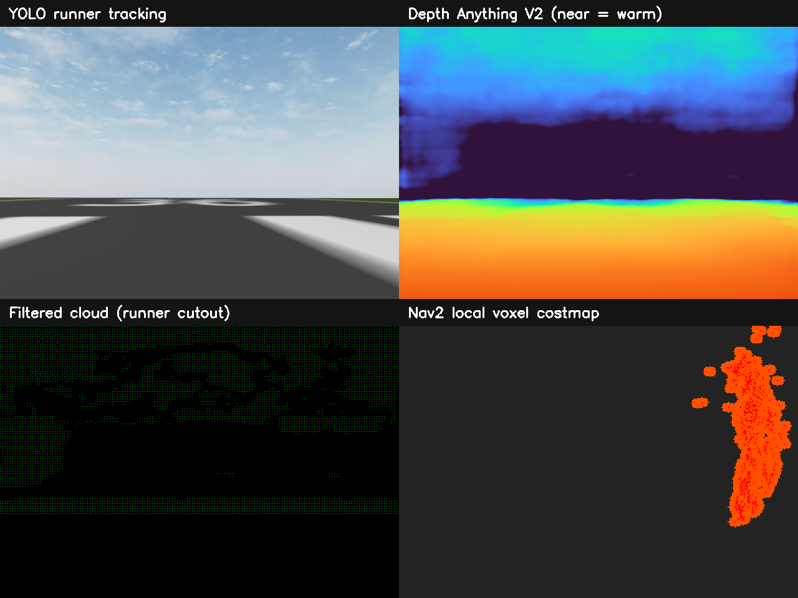
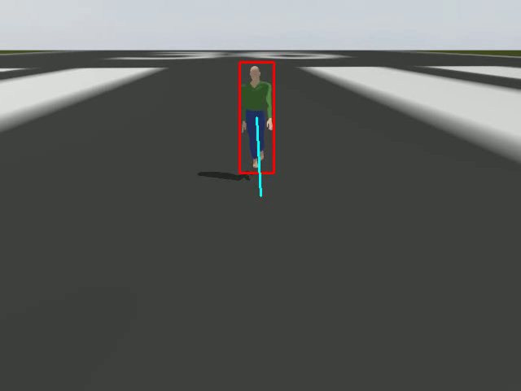
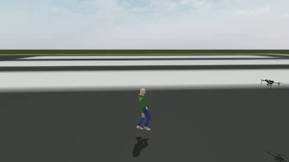
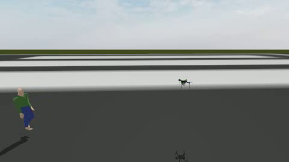

# Autonomous Runner Tracking Drone

This project is being developed incrementally from laptop-camera perception
into an autonomous ROS 2 / Gazebo runner-following drone. The project has now
progressed into monocular AI-depth mapping: it detects a moving runner, removes
the runner silhouette from the generated 3D cloud, and maps nearby hazards in
a Nav2 rolling voxel costmap.

## Current progress

- Laptop-camera capture with explicit resource cleanup
- YOLO person detection and persistent object tracking
- Highest-confidence initial runner selection and stable tracking-ID lock
- Bounding box, confidence, tracking state, and normalized image offsets
- Separate camera, detection, tracking, annotation, and pipeline classes
- ROS 2 Jazzy perception, simulation, and flight-control packages
- Gazebo Iris model with tracking camera and forward LiDAR
- Explicit Boolean motion gate and stale-target stop
- Configurable trailing distance with forward and reverse corrections
- MAVROS body-frame velocity control with bounded speed and yaw
- Protected takeoff-follow-land validation with an independent LAND watchdog
- Full-body moving actor on an extended 9.5 m Gazebo route
- Passing follow run with 4.224 m of measured drone travel
- Depth Anything V2 inference from the monocular RGB stream
- Runner-aware 3D cloud masking from the live YOLO bounding box
- Nav2 voxel mapping from the environment-only filtered cloud
- Stable depth-1 sensor QoS and bounded point-cloud processing

## Latest milestone: dynamic AI-depth obstacle mapping



[Watch the 20-second dynamic mapping demonstration](docs/media/dynamic_depth_costmap_demo.mp4)

### Autonomous follow with live rolling map

The latest validation combines takeoff, moving-runner detection, metric target
vectors, body-frame MAVROS velocity control, runner-masked AI-depth points and
a rolling Nav2 voxel costmap in one flight.



[Watch the 50-second follow-with-live-costmap recording](docs/media/follow_with_live_costmap.mp4)

The recorded run moved the Iris 2.92 m while the costmap origin moved 2.90 m.
It received 22 filtered clouds, maintained 15,782–18,965 occupied cells and
passed the moving-actor, physical-following and mapping-while-following checks.

### Runner-speed following with ground-filtered mapping

The next stage accelerates the Gazebo actor to approximately 2.4 m/s and lets
the safety-limited follower reach 2.5 m/s. Target-velocity feed-forward helps
maintain trailing distance, while a forward point-cloud corridor limits speed
from available braking distance.



[Watch the 50-second runner-speed validation](docs/media/runner_speed_follow_with_costmap.mp4)

Ground-plane and lower-image suppression reduced the occupied map from the
earlier 15,000–19,000-cell flood to 5,084–9,941 cells. The recorded vehicle
traveled 9.05 m and its rolling costmap followed for 8.70 m.

The moving-runner validation measured a **51.0% reduction** of points inside
the live runner silhouette while the environmental costmap remained occupied
between **1,283 and 2,035 cells**. The person moved through the scene without
causing the filtered cloud or obstacle layer to collapse.

The original single-file prototype remains as the historical foundation.
Git commits, pull requests, and `PROJECT_HISTORY.md` show how the project moved
from that prototype to modular perception, Gazebo integration, and autonomous
distance-controlled following.

## Previous milestone: full-body extended follow



[Watch the 15-second annotated drone-camera video](docs/media/full_body_runner_follow_15s.mp4)

[Watch the 15-second external Gazebo travel video](docs/media/gazebo_drone_travel_15s.mp4)

The external video makes the vehicle's translation visible from a fixed Gazebo
camera. These start and end frames show the change in position:

| Start | End |
|---|---|
|  |  |

The protected validation achieved:

- desired trailing distance: **2.5 m**
- final estimated distance: **2.918 m**
- final distance error: **0.418 m**
- horizontal drone path: **4.224 m**
- fresh target ratio: **99.7%**
- minimum validation altitude: **2.180 m**
- result: **`FOLLOW_VALIDATION_PASS`**

The raw evidence is available at
[`docs/evidence/full_body_follow_validation.csv`](docs/evidence/full_body_follow_validation.csv).

Both MP4 files contain only unique ROS/Gazebo image messages. The annotated
camera video is 640x480 at 10 FPS with 150 frames; the external Gazebo video is
480x270 at 5 FPS with 75 frames. Both have a verified duration of exactly
15.000 seconds.

The earlier short-distance video and evidence remain in the repository to
preserve the visible development history.

## Run the laptop-camera perception milestone

Use a Windows Python environment so OpenCV can access the laptop camera:

```powershell
py -m pip install -r requirements.txt
py run_camera.py
```

The first run may download the YOLO model weights. Stand in view of the camera
and press `q` in the preview window to exit.

## Structure

```text
perception/
  camera_source.py
  person_detector.py
  runner_tracker.py
  frame_annotator.py
  pipeline.py
  models.py
tests/
ros2_ws/src/drone_perception/
ros2_ws/src/drone_control/
ros2_ws/src/drone_simulation/
diagnostics/
docs/media/
docs/evidence/
```

See `PERCEPTION_ARCHITECTURE.md` for the component boundaries and planned path
toward depth association, point clouds, costmaps, and path planning.

See `GAZEBO_SIMULATION.md` for the Gazebo-to-ROS workflow,
`RUNNER_FOLLOWING.md` for the simulation flight workflow, and
`PROJECT_HISTORY.md` for the chronological development record.
